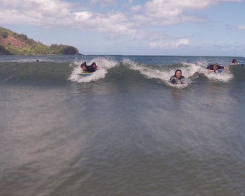

# Seam carving

## Description

**Seam Carving** - 
it is an image resizing algorithm that preserves important elements and removes less significant ones. If you look at the image as a table of pixels, then at each iteration of this algorithm, only one pixel is removed from the column (or row).
[Additional information.](https://perso.crans.org/frenoy/matlab2012/seamcarving.pdf)

Before:

After:

After the algorithm finished working, 200 vertical pixel sequences were removed, which helped to reduce the image by * 30% *. It's worth noting that unlike conventional approaches, where the image would be cropped or scaled out of proportion, * seam carving * left a set of important objects in the photo intact. The * seam carving * algorithm is actively used in modern graphic editors.

## Algorithm

* Calculation energy of image
* Find the seam - path side by side with the lowest energy 
* Delete seam
* Repeat until size fits
### Picture after

### Energy

### Seam

### Result

## Launching
Using command line:\
``java Main -i <inputPath> -o <outputPath> -w <widthReduceCount> -h <heightReduceCount>``
* Default values for __width__ and __height__ is __0__
* Input and output files must be in __png__ format

__UI will be implemented later__

